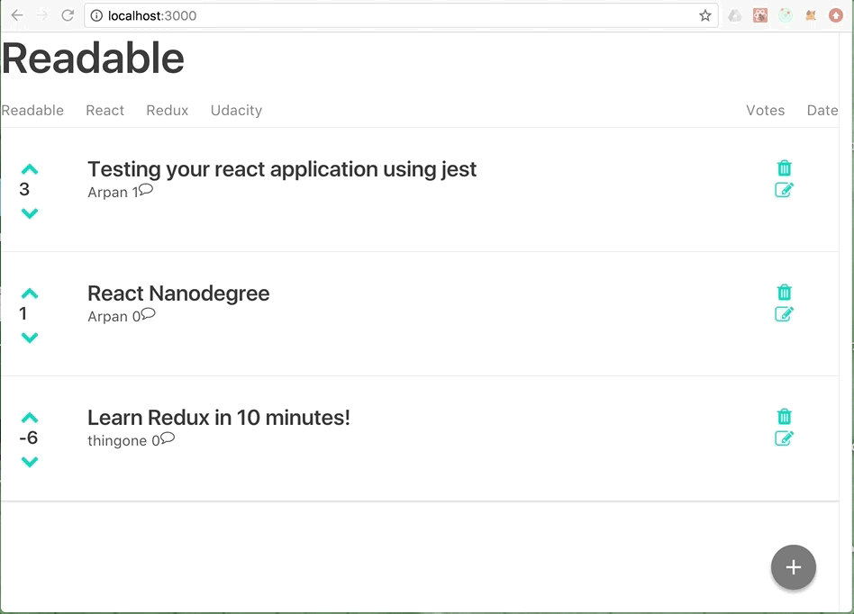

# Readable

[]()
[](https://coveralls.io/github/arpankotecha/readable?branch=master)
[]()

Readable is an anonymous content and comment application. Users will be able to post content to predefined [categories](src/server/categories.js), comment on their posts and other users' posts, and vote on posts and comments. Users will also be able to edit and delete posts and comments.




## Getting Started
```shell
$ git clone https://github.com/arpankotecha/readable.git
$ npm install
$ npm start
```

## Contributing
Feel free to submit a pull requests! For specifics on how to contribute to this project, check out the  [contributing file](CONTRIBUTING.md).

## License
My Reads is released under the [MIT License](LICENSE).
